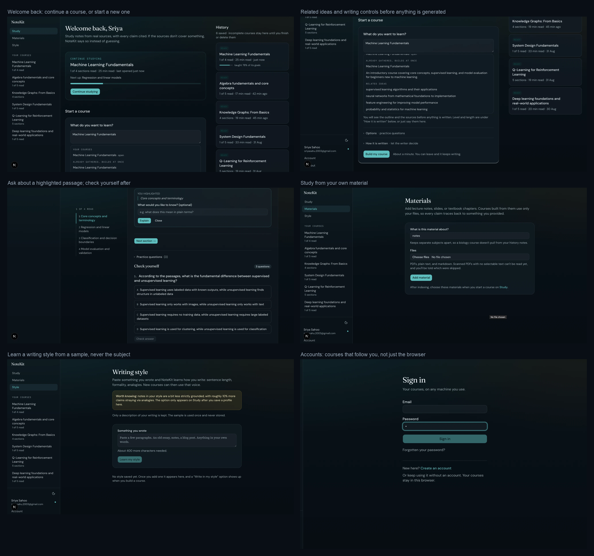
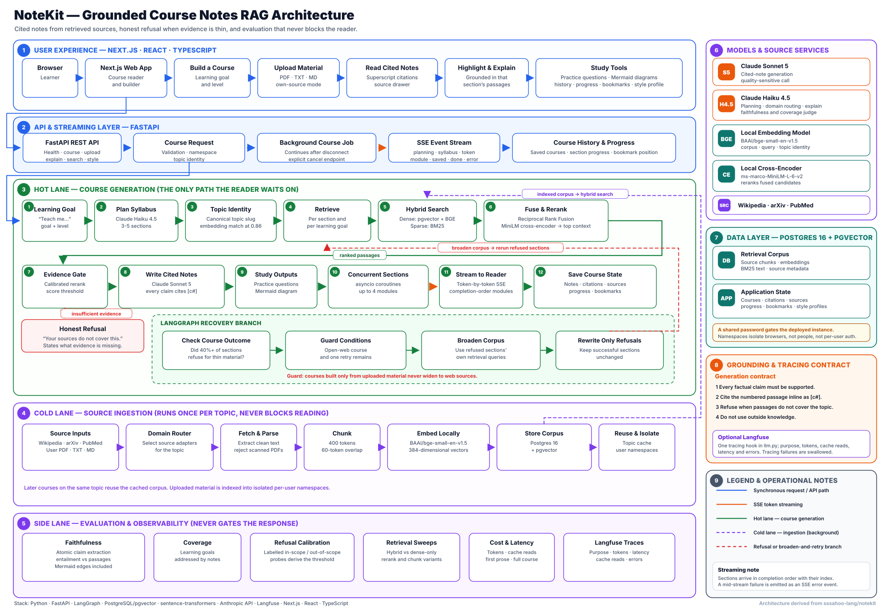
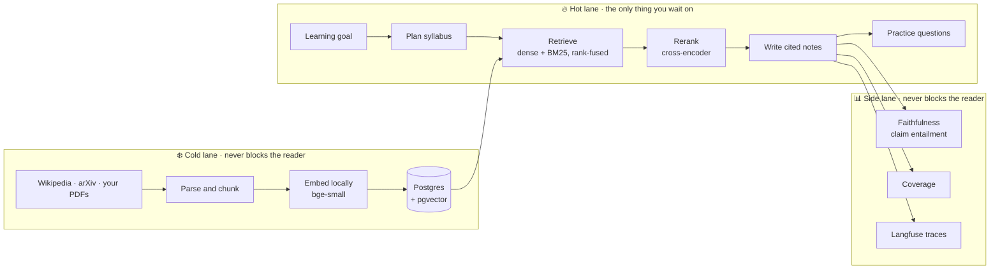
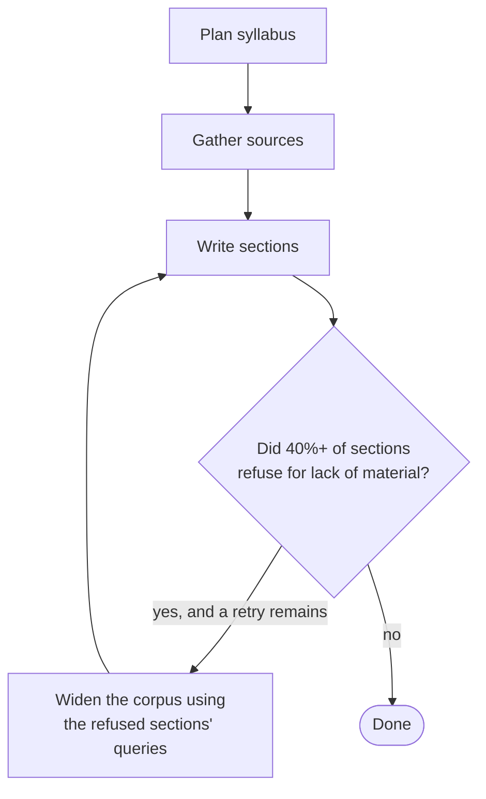

# NoteKit

**Study notes you can fact-check line by line.**


Most AI study tools always give you an answer. You cannot tell which sentences
came from a real source and which the model invented, and they never admit when
they have nothing to work from. NoteKit is a retrieval-augmented generation
(RAG) system built the other way round: it retrieves real passages first, writes
only from those, cites each claim back to the passage it came from, and refuses
when retrieval comes back thin.

The refusal and the grounding are not promises. They are measured. **95% of
generated claims are verified against their retrieved context, and 100% of
deliberately out-of-scope questions are correctly refused.**

[](docs/screenshots.png)

### Contents

[What it does](#what-it-does) ·
[Results](#results) ·
[Quick start](#quick-start) ·
[How it works](#how-it-works) ·
[What makes it different](#what-makes-it-different) ·
[Usage](#usage) ·
[Evaluation and tracing](#evaluation-and-tracing) ·
[Deploying](#deploying) ·
[Project layout](#project-layout) ·
[Engineering notes](#engineering-notes) ·
[Limitations](#limitations-and-what-isnt-proven) ·
[Status](#status)

---

## What it does

- **Turns a goal into a course.** "Teach me Q-learning at an intermediate level"
  becomes a planned syllabus of 3-5 sections, each written from retrieved
  passages.
- **Cites every claim.** Inline superscript markers link to the exact source
  passage, numbered per section like footnotes.
- **Refuses honestly.** When retrieval scores below a calibrated threshold, the
  section says what is missing instead of inventing it.
- **Studies from your own material.** Upload PDFs, text or markdown and build a
  course from only your files.
- **Explains what confuses you.** Highlight any sentence and ask. It is
  answered from that section's own passages, so "explain it simpler" cannot
  become "make something up".
- **Writes in your style.** Learns how you write from a sample and applies it to
  any course, at a measured cost to grounding.
- **Generates practice questions** answerable from the same passages.
- **Draws diagrams** as Mermaid, so every node and edge is a claim that gets
  scored like the prose.

## Results

Measured over a fixed syllabus (`fixtures/q-learning.json`, 4 sections) against
a 13-document corpus from Wikipedia and arXiv:

| Metric | Result |
|---|---|
| **Faithfulness**, claims entailed by retrieved passages | **95.3%** (93.0-97.6% across runs) |
| **Refusal accuracy**, out-of-corpus questions correctly declined | **100%** (16/16) |
| Cost per course | $0.22-0.38 ($0.34 with practice questions) |
| Time to first prose | 18.4s · full course 41.2s |
| Coverage, learning goals addressed | 42-67%, see [Limitations](#limitations-and-what-isnt-proven) |

Refusal is calibrated from data rather than guessed. Questions the corpus covers
rerank at +0.28 to +8.50; questions it does not (the French Revolution,
sourdough fermentation, Honda timing belts) score −3.54 to −11.01. The gap is
clean and the threshold sits inside it:

```bash
uv run notekit calibrate evalsets/q-learning.json
```

## Quick start

**Requirements**: Python 3.11+, Docker (for Postgres + pgvector),
[uv](https://docs.astral.sh/uv/), Node 20+ (for the web UI), and an Anthropic
API key.

Embeddings (`bge-small-en-v1.5`) and reranking (`ms-marco-MiniLM-L-6-v2`) run
**locally**, so `ANTHROPIC_API_KEY` is the only secret required. The first run
downloads about 220MB of model weights.

```bash
git clone https://github.com/sssahoo-lang/notekit.git
cd notekit

docker compose up -d      # Postgres 16 + pgvector on :5433
uv sync                   # Python dependencies
cp .env.example .env      # then add your ANTHROPIC_API_KEY
```

```bash
./scripts/dev.sh                        # API on :8000
cd web && npm install && npm run dev    # UI on :3000
```

Then open [localhost:3000](http://localhost:3000).

`./scripts/dev.sh` checks the environment, frees a stale port, and starts
Postgres if it is down. If anything misbehaves, `./scripts/doctor.sh` diagnoses
and repairs what it can.

## How it works

Three lanes, separated by whether they are allowed to make you wait.

[](docs/architecture.svg)

<sub>Full-size diagram: [docs/architecture.svg](docs/architecture.svg)</sub>

The same three lanes, in brief:



**Cold lane** runs once per topic. Sources are fetched, parsed, chunked,
embedded locally and stored. Every later course on that topic is a cache hit.

**Hot lane** is the only path a reader waits on. Sections generate concurrently
as asyncio coroutines and stream token by token over SSE, so reading can start
while later sections are still being written.

**Side lane** scores what was produced and never gates the response.

### Retrieval

Hybrid, because dense and sparse retrieval fail differently. Dense vectors catch
paraphrase; BM25 catches exact terminology. Results are merged by **reciprocal
rank fusion**, because fusing on raw score would let whichever list has larger
numbers win by default, then reranked by a cross-encoder, which tightens the
context and shrinks the generation prompt at the same time.

### Routing and topic identity

Fetching every source for every topic wastes round trips and pollutes the
corpus: arXiv has nothing useful on the French Revolution, PubMed nothing on
Baroque music. A router classifies the subject once per topic and picks
adapters from that.

| Domain | Sources |
|---|---|
| computing · physical-science · social-science | Wikipedia + arXiv |
| biomedical | Wikipedia + PubMed |
| humanities · general | Wikipedia |

Wikipedia is in every row deliberately. It is the only source covering
foundations across every domain, and arXiv alone cannot teach basics because it
indexes the research frontier rather than pedagogy.

Topic identity is resolved by embedding, not string matching, because the
failure is semantic: "RL" and "reinforcement learning" share no characters,
while "linear algebra" and "linear regression" share most of them. Measured on
the local embedding model, restatements of one subject score 0.888-0.920 and
distinct subjects top out at 0.798, so the merge threshold sits at 0.86 with
clear air either side. Abbreviations are handled upstream by the planner, which
expands "RL" to "reinforcement-learning" before the slug is ever compared.

```bash
uv run notekit topics                                       # what shares a corpus
uv run notekit topics --check "linear algebra, linear regression"
```

### The generation contract

Four rules, in priority order, given to the model with the retrieved passages:

1. Every factual claim must be supported by one of the numbered passages.
2. Cite the passage inline as `[c123]`.
3. If the passages do not cover the topic, refuse and say what is missing.
4. Do not use outside knowledge, even where you are confident it is correct.

### Orchestration

The synchronous path runs as a **LangGraph** state machine with one real
decision in it:



A straight line of plan → gather → write is a for-loop and does not need a
graph. What earns it is the failure this project actually hit: build a course on
a thin corpus and sections refuse, correctly, but leaving a mostly empty course
with no recourse. The graph branches on that, widening the corpus from the
refused sections' own queries and rewriting only those.

Two guards. A course built from **uploaded material never widens**, because
fetching from the open web would silently break the promise that it used only
your files. And there is **one retry, not a loop**. A corpus still thin after
widening is telling you something true.

The streaming API path keeps its own orchestration: it emits tokens as they
arrive and cancels mid-flight, neither of which the graph models.

## What makes it different

Plenty of projects do RAG. Four things here are less common:

**Citation per claim, not per answer.** You can check any individual sentence,
not just "here are some sources at the bottom".

**A refusal path that is calibrated and measured.** Standard RAG answers
regardless of what retrieval returned. This has a score threshold derived from
labelled probes, and abstention is scored like any other behaviour.

**Faithfulness as a number, not an assumption.** An automated judge decomposes
notes into atomic claims and checks each for entailment against the retrieved
passages. Diagrams are included: every Mermaid edge becomes a claim.

**Personalisation with a known cost.** Style matching is measured at roughly
**10 points of faithfulness**, so it ships off by default. Knowing the price is
the point.

---

## Usage

### CLI

```bash
# Fetch and index a corpus. No API key needed.
uv run notekit ingest "q-learning" --limit 10

# See what retrieval returns. No API key needed.
uv run notekit search "how does the Bellman equation define the Q function" -n q-learning

# Build a course.
uv run notekit course "teach me Q-learning at an intermediate level"
uv run notekit course "teach me Q-learning" --graph      # via the LangGraph loop

# Study from your own files.
uv run notekit upload ~/Documents/lecture-notes --user sriya --topic ml
uv run notekit course "teach me how neural networks train" -n user-sriya-ml

# Freeze a syllabus so evaluation runs are comparable.
uv run notekit plan "teach me Q-learning" --save fixtures/q-learning.json

# Score faithfulness and coverage. Repeat to see the spread.
uv run notekit eval --syllabus fixtures/q-learning.json --repeat 3 --explain

# Calibrate the refusal threshold. No API key needed.
uv run notekit calibrate evalsets/q-learning.json

# Compare retrieval configurations.
uv run notekit sweep --syllabus fixtures/q-learning.json -n q-learning --repeat 3

# List saved courses, then export one as Markdown notes. No API key needed.
uv run notekit courses
uv run notekit export 13 --to ~/ObsidianVault
```

### HTTP API

| Endpoint | Purpose |
|---|---|
| `GET /api/health` | Liveness and database connectivity |
| `POST /api/course` | Generate a course, streamed as SSE |
| `GET /api/courses` · `GET/DELETE /api/courses/{id}` | Saved course history |
| `PATCH /api/courses/{id}/progress` | Sections read and bookmark position |
| `POST /api/explain` | Explain a highlighted passage from its own sources |
| `POST /api/upload` | Index uploaded files into a user namespace |
| `GET /api/style/{user}` · `POST /api/style/learn` | Read and learn writing styles |
| `GET /api/namespaces` · `GET /api/search` | Inspect indexed corpora and retrieval |
| `POST /api/calibrate` | Run a refusal calibration set |

`POST /api/course` emits: `planning`, `syllabus`, `ingesting`, `ingested`,
`module_start`, `token`, `module`, `module_error`, `saved`, `cancelled`, `done`,
`error`. Sections arrive in completion order, each carrying an `index` for the
client to place it by. A failure mid-stream arrives as an `error` event rather
than an HTTP status, because the headers are long gone by then.

Generation continues if the client disconnects; `POST /api/courses/{id}/cancel`
stops it explicitly.

### Exporting a course

```bash
uv run notekit export 13 --to ~/ObsidianVault
```

The output is plain Markdown and opens anywhere, but it is shaped for
[Obsidian](https://obsidian.md), because that is where the shape pays off.
Every cited document becomes its own note, every retrieved passage carries a
block id, and each `[c123]` marker becomes a footnote linking to that exact
passage:

```markdown
A knowledge graph is a knowledge base that uses a graph-structured
data model to represent and operate on data.[^c3436]

[^c3436]: [[Sources/Knowledge graph#^c3436|Knowledge graph]]
```

So a claim can still be checked after it leaves the app: the passage it rests
on travels with it. It also makes the grounding visible: in the graph view, a
section whose claims all trace back to one source appears as a node with a
single inbound edge, which is a weakness the web reader cannot show you.
Refusals export as refusals, and Mermaid diagrams pass through untouched since
Obsidian renders them natively.

Passages are grouped by document rather than one note per chunk, so the number
of edges into a source means "how many claims rest on this document".

### Tests

```bash
uv run pytest
```

116 tests, no API key and no database. Every module here is either pure logic
or has its one external dependency (the LLM call, Postgres, the embedding
model) faked at the boundary, so the whole suite runs offline in under a
second. Covers topic-identity merging at the 0.86 threshold (exact match,
merge, new topic, and the embedding backfill path), the domain router's
source table, the shared-password gate (including a password rotation
invalidating the old token), the quiz text parser, Mermaid-to-claim
extraction, the Markdown export (including the invariant that every exported
citation resolves to a real passage), and the LangGraph broaden-and-retry
decision, including the guard that a course built from uploaded material
never widens to the open web. What it does not cover: retrieval, generation, and the API layer itself,
which need a running Postgres and a real API key and are exercised instead by
`notekit eval` and `notekit sweep` against fixed syllabi.

## Evaluation and tracing

Every model call funnels through `llm.py`, so [Langfuse](https://langfuse.com)
hooks in at one place, with each call labelled by purpose (`plan-syllabus`,
`write-notes`, `quiz`, `judge-extract-claims`, `judge-verdicts`,
`judge-coverage`, `explain-selection`, `learn-style`) carrying tokens, cache
reads, latency and errors.

It is off unless `LANGFUSE_PUBLIC_KEY` and `LANGFUSE_SECRET_KEY` are set, and
failures inside tracing are swallowed. A missing observability backend must
never stop someone studying.

## Deploying

The API ships as a container: CPU-only torch, model weights baked in at build
time so nothing is downloaded on boot, single worker, non-root. It needs about
800 MB of RAM with both models warm, which is the cost of keeping embeddings and
reranking local.

A shared password can be put in front of the whole API by setting
`SITE_PASSWORD`, which is a lock on the front door, not authentication. Unset
it and the gate does not exist, which is why none of it shows up in local
development.

Step by step, including what to set where and what it costs: **[DEPLOY.md](DEPLOY.md)**.

## Project layout

```
src/notekit/
  api.py          FastAPI app, SSE streaming, background course jobs
  pipeline.py     Hot lane: plan, retrieve, write cited notes, quiz
  graph.py        LangGraph state machine with the broaden-and-retry branch
  retrieval.py    Hybrid dense + BM25, rank fusion, cross-encoder reranking
  ingest.py       Cold lane: fetch, parse, chunk, embed, store
  router.py       Which sources a subject should be answered from
  topics.py       When two names for a subject mean the same corpus
  adapters/       Source adapters: wikipedia.py, arxiv.py, pubmed.py
  upload.py       User files into isolated per-user namespaces
  evaluation.py   Faithfulness and coverage judging, diagram claims
  calibration.py  Deriving the refusal threshold from labelled probes
  sweep.py        Comparing retrieval configurations
  explain.py      Answering questions about a highlighted passage
  style.py        Learning a writing style without carrying content
  llm.py          The only module that touches the Anthropic SDK
  tracing.py      Optional Langfuse spans
  auth.py         The shared password gate for a deployed instance
  courses.py      Saving, listing and loading generated courses
  vault.py        Exporting a course as linked Markdown notes
  config.py       Every tunable choice in one place

web/src/
  components/     Reader, section rail, citations, quiz, ask-about, diagrams
  lib/            API client, profile, course status helpers

scripts/dev.sh    Start the API reliably
scripts/doctor.sh Diagnose and repair the environment
Dockerfile        Production image: CPU-only torch, weights baked in
DEPLOY.md         Putting it online, and what that costs
evalsets/         Labelled probes for refusal calibration
fixtures/         Frozen syllabi so evaluation runs are comparable
```

---

## Engineering notes

The parts that took measurement rather than guesswork. Expand any of them.

<details>
<summary><b>Streaming: threads were the wrong tool</b> · 52.3s to 18.4s to first prose</summary>

<br>

Time-to-first-prose was 52 seconds. The obvious suspects were wrong. Retrieval
takes 3.9s for all four sections, and four raw concurrent API streams reach
first token in 0.76-2.33s. The cause was that streaming is I/O-bound but
*parsing its SSE frames is Python work*: four worker threads each parsing their
own stream contended on the GIL and staggered each other's first token by tens
of seconds.

Rewriting the module loop as coroutines on one event loop fixed it. Retrieval
stays on a thread via `asyncio.to_thread`, because that genuinely is CPU-bound
torch work and would otherwise block every other section's stream.

| | Threads | Async |
|---|---|---|
| First prose | 52.3s | **18.4s** |
| Stagger between sections | ~35s | **7.6s** |
| Whole course | 82.8s | **41.2s** |

Much of the remaining wait is simply that the notes are long: given
`MAX_TOKENS_NOTES = 4000` the model writes ~5,800 characters, taking 37s against
8.7s at `max_tokens=700`.

</details>

<details>
<summary><b>Prompt caching: structured output broke the prefix</b> · $0.658 to $0.339 per course</summary>

<br>

A course with practice questions cost $0.658 against $0.25 without, because the
quiz call re-sent the passages the notes call had just sent. Caching should have
covered that and did not: the quiz used structured output, and the injected
schema changes the request prefix *ahead of* the cached block, so nothing
matched.

The obvious fix, one merged call producing notes and quiz together, would have
removed token streaming, since structured output cannot stream prose. Instead
the quiz became a plain completion in a fixed layout, parsed by regex, with
structured output as a fallback when parsing fails. The prefix then matches the
notes call exactly.

| | Before | After |
|---|---|---|
| Cache read | 0 | 40,548 tokens |
| Cost with questions | $0.658 | **$0.339** |

</details>

<details>
<summary><b>Style matching costs about 10 points of faithfulness</b> · so it ships off by default</summary>

<br>

A profile learned from casual writing about databases produced Q-learning notes
that opened conversationally and explained exploration-versus-exploitation
through choosing ice cream flavours, in second person, citations intact, with
no database subject matter carried across.

| Voice | Faithfulness |
|---|---|
| Default | 97.3%, 98.8% |
| Learned style | 89.5%, 85.5% |

Inspecting the unsupported claims showed two causes. Some are real grounding
failures. Reaching for a familiar comparison pulls in outside knowledge like
multi-armed bandits that no passage supplied. Others are rhetorical framing
("exploration is the cost required to learn") that the claim extractor cannot
distinguish from assertion, so part of the 10 points is measurement artefact.

The profile is safe by construction: it describes **form only**: sentence
rhythm, register, habits of expression, verified to contain no subject matter
from the sample, and the sample is neither stored nor sent at generation time.
Matching how someone *writes* is in scope; matching how they *understand* is
not, since mirroring a learner's misconceptions would reinforce errors while
citing correct sources.

</details>

<details>
<summary><b>Citations had to stop fighting the prose</b> · 4.1 to 2.7 markers per hundred words</summary>

<br>

At 4.1 markers per hundred words, drawn as filled monospace chips reading
`c2751`, citations interrupted the line more often than a comma. Three changes
brought that to 2.7 groups per hundred words without losing a single link:
numbered per section like footnotes, rendered as superscripts, and consecutive
markers merged. The model frequently emits `[c1291][c1327]` for a single claim.
A "hide citations" toggle turns markers off entirely; the source list stays
either way, so nothing becomes uncheckable.

</details>

<details>
<summary><b>A venv that broke for a reason nothing reported</b> · macOS APFS clones, hidden <code>.pth</code> files</summary>

<br>

`ModuleNotFoundError: No module named 'notekit'` kept appearing from a
virtualenv that had worked minutes earlier. Four hypotheses were wrong:
concurrent `uv run`, `uv sync --reinstall-package`, a plain reinstall, and a
missing trailing newline in the path file. None of them reproduced it, and the
`.pth` was always present, valid, and pointing at a directory that existed.

The cause is a three-part interaction. uv installs files by cloning them from
its cache; on macOS an APFS clone inherits the source's `UF_HIDDEN` flag; and
Python 3.11+ **silently skips hidden `.pth` files**. So the editable install's
path file was there and correct and simply ignored, with nothing logged. `ls
-lO` shows it: `hidden`.

`link-mode = "copy"` in `[tool.uv]` reduces how often it happens but does **not**
stop it, because the flag comes back on later runs. The durable fix is a
`sitecustomize.py` in site-packages adding `src` to `sys.path`: the hidden-file
check applies only to `.pth` files, so a `.py` is honoured either way. Verified
over eight consecutive runs with the `.pth` still flagged hidden.
`scripts/doctor.sh` writes it, `scripts/dev.sh` calls doctor first, and
`PYTHONPATH=src` remains as a third backstop.

</details>

<details>
<summary><b>Reading a 7,000-word course</b> · 21,019px of scroll down to 3,067px</summary>

<br>

Every section open at once made a course roughly twenty screens of
uninterrupted scroll with no way to skim it. Sections now collapse, and the same
course goes from 21,019px to 3,067px, with the bookmarked one open, jumping
from the rail revealing its target, and a section being written forcing itself
open so streaming never happens off-screen. Bookmarks record the paragraph, not
just the section.

</details>

---

## Limitations and what isn't proven

Stated plainly, because a measurement you cannot trust is worse than none.

**Coverage is not a trustworthy metric.** Two runs of the *same* fixed syllabus
returned 41.7% and 66.7%, a 25-point swing with nothing changed. There are only
12 learning goals in the fixture, so each is worth 8.3 points, and the judge is
not deterministic. `notekit eval --repeat N` exists to make that visible rather
than hide it.

**A previous claim was retracted.** An earlier version of this README reported
that per-goal retrieval lifted coverage from 60% to 83%. Those measurements came
from different planner-generated syllabi, and the run-to-run variance turned out
to be as large as the effect. The change is still defensible on mechanism, since
generation can only address a goal if retrieval surfaced material for it, but it
has not been measured, and it is not counted as a result.

**The judge shares a model family with the writer.** Faithfulness is judged by
Haiku against notes written by Sonnet, so the grader shares blind spots with the
writer. The figure is better read as a regression signal than as ground truth.
An independent judge, either a different provider or hand-checking against a
labelled set, is how to establish it properly.

**The retrieval sweep does not yet distinguish its configurations.**

| Config | Faithfulness | Claims |
|---|---|---|
| baseline (hybrid + rerank) | 89.6% | 201 |
| no-rerank | 85.2% | 155 |
| dense-only | 88.8% | 134 |
| large-chunks | needs its own index | n/a |

Best minus worst is 4.4 points against 4.6 points of run-to-run noise. The gap
is inside the noise; `--repeat 3` or more is needed before concluding anything,
and the command says so rather than presenting an ordering as a finding.

**No real authentication.** A deployed instance can be put behind one shared
password, but everyone who gets in shares one identity. Uploads are isolated per
user and verified not to leak across namespaces, yet `--user` is still taken on
trust. This is isolation between browsers, not access control between people,
and it needs real auth before more than one person uses it.

**Other gaps.** Scanned PDFs are rejected rather than OCR'd. Topic
canonicalisation relies on the planner emitting a consistent slug, so close
variants may still fragment a corpus. arXiv alone is a poor source for
foundational material, since it indexes the research frontier, not pedagogy,
which
is why Wikipedia is fetched alongside it.

---

## Status

| Milestone | State |
|---|---|
| 1. Core loop: ingest, retrieve, cited notes | done |
| 2. Evaluation: faithfulness, coverage, calibration, tracing | done |
| 3. Practice questions | done |
| 4. Uploads, per-user namespaces, style matching | done |
| 5. Open-domain routing across many sources | done |
| 6. Web UI | working locally |
| 7. Deployment | container and gate built and verified; not yet hosted |
| 8. Markdown export: courses as linked notes | done |

Beyond the milestones: 116 unit tests cover the logic layer, and every
citation the export writes is verified to resolve to a real source passage.
The export's Obsidian-specific rendering (block-reference jumps, collapsed
callouts) has not yet been confirmed inside Obsidian itself.

Built with Python, FastAPI, Postgres/pgvector, the Anthropic API, LangGraph,
Langfuse, sentence-transformers, Next.js, React and TypeScript.
